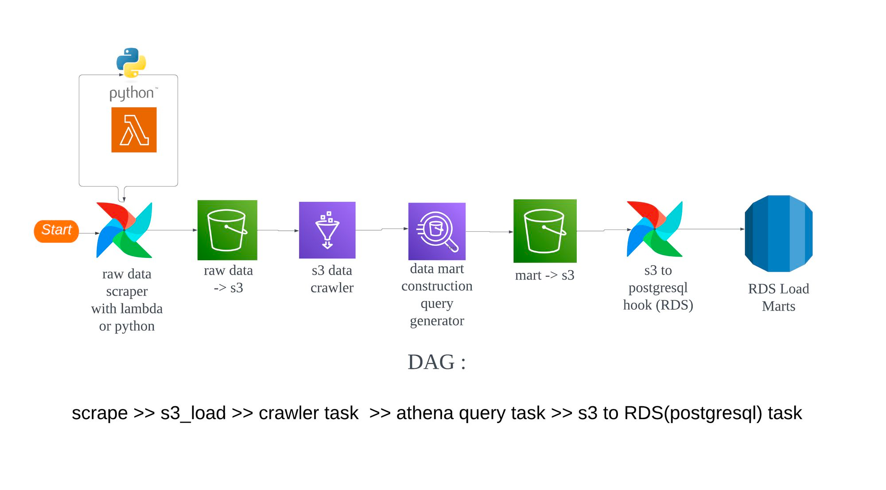
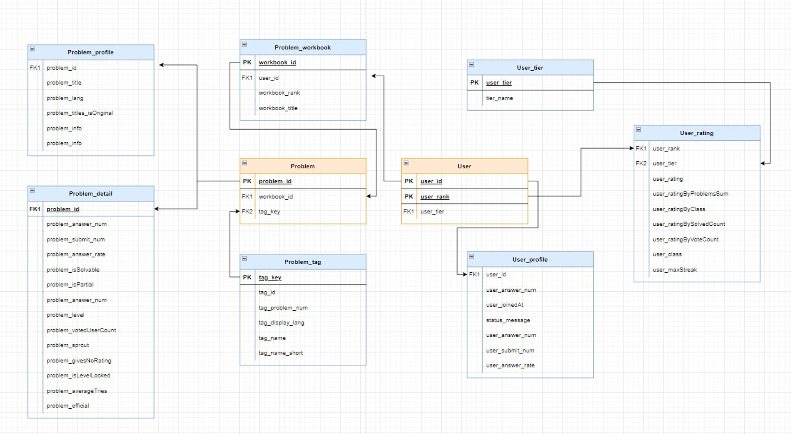

# 🚀 개요
- 백준을 통해 코딩테스트를 준비하는 사람들을 위한 데이터 분석 서비스
- Airflow를 통해 데이터를 수집하고, 시각화를 통해 같은 Tier의 유저 정보를 제공 

# 🎓 팀소개
| 이름 | 김수민     | 김형준              | 유하준               | 조주혜 | 한기호                    |
|----|---------|------------------|-------------------| ---|------------------------|
| 역할 | 데이터 시각화 | DB환경 구축  크롤링 | Lambda, Athena 크롤링 | API 크롤링 | AWS Athena API 크롤링 |
| 기여도 | 20 % | 20%              | 20% | 20% | 20 % |

# 📌 사용 데이터 
| 데이터 출처 | 데이터 분류  | 데이터 설명                              | 
|--------|---------|-------------------------------------|
 | 백준, Solved.ac   | 유저 데이터  | 백준과 Solved.ac API을 공통으로 이용하는 유저 데이터 |
| 백준, Solved.ac | 문제 데이터  | 백준과 Solved.ac API를 통해 수집하는 문제와 문제의 메타데이터 |            
| 백준 | 문제집 데이터 | 백준에서 삼성기출문제처럼 문제집과 문제의 ID를 담고 있는 정보 | 

# 🔗 데이터 파이프라인

# 📚 DB ERD

# 🔨 Tech Skill
| Role          | Stack                                                                                                                                                                                              |
|---------------|----------------------------------------------------------------------------------------------------------------------------------------------------------------------------------------------------|
| Language      |                                                                                                      |
 | DataLake      |                                                                                                    |
| DataMart      |                                                                                              |
| ETL           |   | 
| ETL Scheduler |                                                                                              | 

