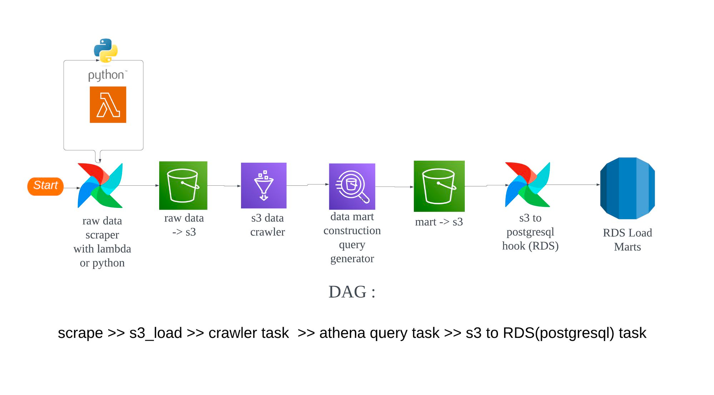
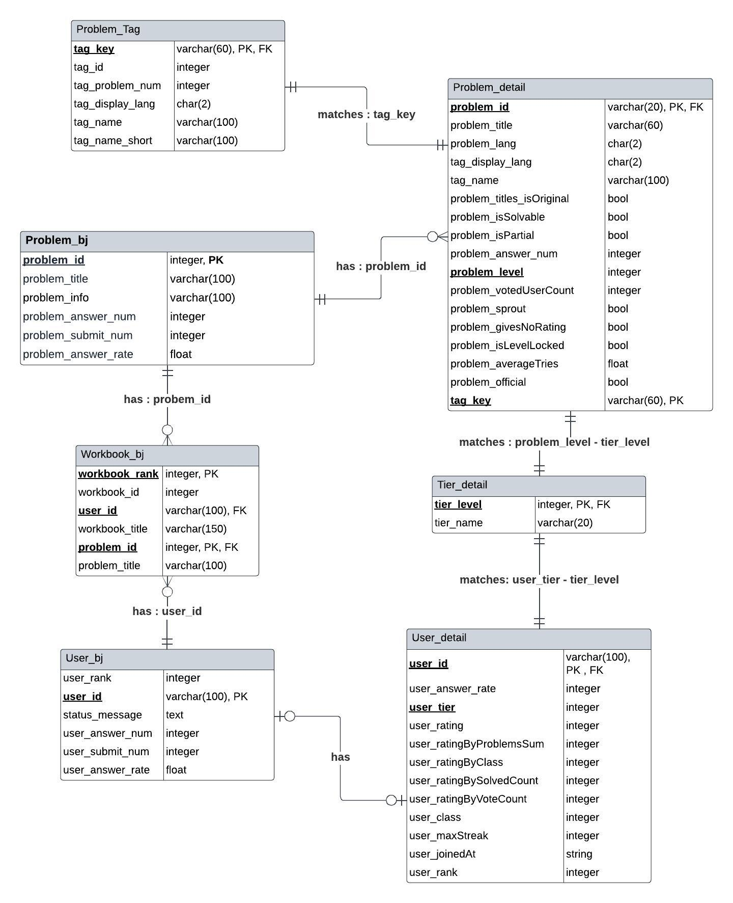
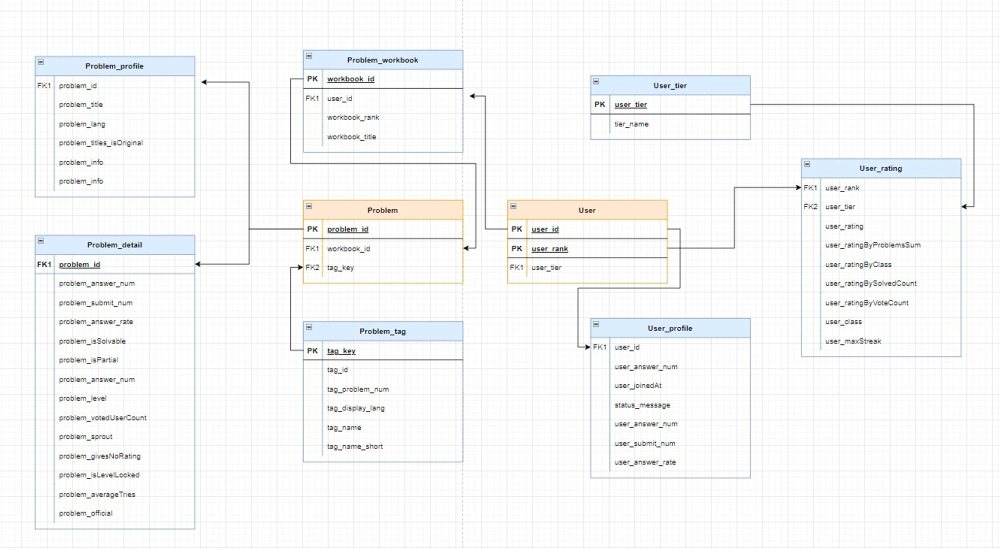

# 🚀 개요
- 백준 코딩테스트를 준비하는 사람들을 위해 데이터 분석을 활용한 인사이트를 제공하기 위해 데이터 마트를 구축했습니다. 
- Airflow, S3, Lambda, Athena, RDS를 사용하여 데이터 파이프라인을 구축하고 데이터를 수집하여 분석에 활용할 수 있는 데이터 마트를 만들었습니다. 이를 통해 분석과 시각화를 통해 백준 인사이트를 제공할 수 있습니다.

# 🎓 팀소개
| 이름 | 김수민     | 김형준              | 유하준               | 조주혜 | 한기호                    |
|----|---------|------------------|-------------------| ---|------------------------|
| 역할 | 데이터 시각화 | DB환경 구축  크롤링 | Lambda, Athena 크롤링 | API 크롤링 | AWS Athena API 크롤링 |
| 기여도 | 20 % | 20%              | 20% | 20% | 20 % |

# 📌 사용 데이터 
| 데이터 출처 | 데이터 분류  | 데이터 설명                              | 
|--------|---------|-------------------------------------|
 | 백준, Solved.ac   | 유저 데이터  | 백준과 Solved.ac API을 공통으로 이용하는 유저 데이터 |
| 백준, Solved.ac | 문제 데이터  | 백준과 Solved.ac API를 통해 수집하는 문제와 문제의 메타데이터 |            
| 백준 | 문제집 데이터 | 백준에서 삼성기출문제처럼 문제집과 문제의 ID를 담고 있는 정보 | 

# 🔗 데이터 파이프라인

- scrape: 웹 스크래핑 작업을 수행. 웹 페이지에서 필요한 데이터를 추출하는 과정

- s3_load: 스크래핑한 데이터를 Amazon S3에 로드하는 작업을 수행.

- crawler task: AWS Glue라는 완전 관리형 ETL(Extract, Transform, Load) 서비스를 사용하여 S3에 저장된 데이터를 읽고, 데이터 카탈로그를 생성하는 작업. 데이터 카탈로그는 데이터를 쿼리할 수 있도록 메타데이터를 저장하는 데이터베이스.

- athena query task: AWS Athena라는 서버리스 쿼리 서비스를 사용하여 Glue에서 생성한 데이터 카탈로그에 대해 SQL 쿼리를 실행하는 작업

- s3 to RDS(postgresql) task: Athena에서 쿼리한 결과를 다시 S3에 저장한 후, 이를 Amazon RDS(Relational Database Service)의 PostgreSQL 데이터베이스에 로드하는 작업

# 📚 DB ERD

### Raw-Data ERD

### Data-Mart ERD (Denormalized)

# 🔨 Tech Skill
| Role          | Stack                                                                                                                                                                                              |
|---------------|----------------------------------------------------------------------------------------------------------------------------------------------------------------------------------------------------|
| Language      |                                                                                                      |
 | DataLake      |                                                                                                    |
| DataMart      |                                                                                              |
| ETL           |   | 
| ETL Scheduler |                                                                                              | 

